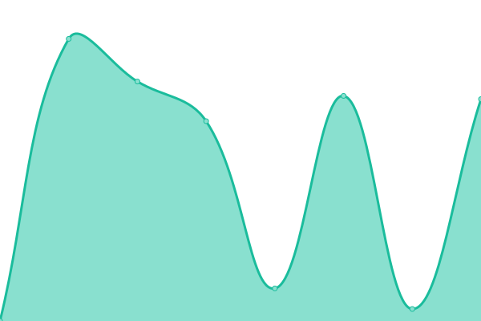
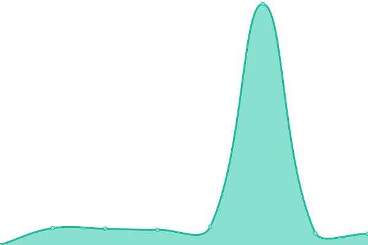
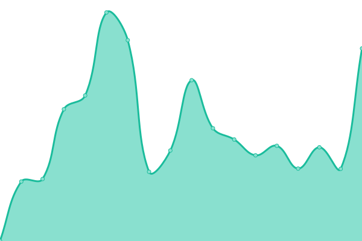

# [📈 Live Status](https://status.foync.xx.kg): <!--live status--> **🟧 Partial outage**

This repository contains the open-source uptime monitor and status page for [Foync](https://status.foync.xx.kg), powered by [Upptime](https://github.com/upptime/upptime).

With [Upptime](https://upptime.js.org), you can get your own unlimited and free uptime monitor and status page, powered entirely by a GitHub repository. We use [Issues](https://github.com/Gjh090420/website_status/issues) as incident reports, [Actions](https://github.com/Gjh090420/website_status/actions) as uptime monitors, and [Pages](https://status.foync.xx.kg) for the status page.

<!--start: status pages-->
<!-- This summary is generated by Upptime (https://github.com/upptime/upptime) -->
<!-- Do not edit this manually, your changes will be overwritten -->
<!-- prettier-ignore -->
| URL | Status | History | Response Time | Uptime |
| --- | ------ | ------- | ------------- | ------ |
|  [🌐 Foync 主站入口](https://foync.xx.kg) | 🟥 Down | [foync.yml](https://github.com/Gjh090420/website_status/commits/HEAD/history/foync.yml) | 

 1664ms
     
 | 

<a href="https://status.foync.xx.kg/history/foync">0.00%</a>
    

|  [🛠️ 个人工具箱](https://foync.xx.kg/tool) | 🟥 Down | [.yml](https://github.com/Gjh090420/website_status/commits/HEAD/history/.yml) | 

 11ms
     
 | 

<a href="https://status.foync.xx.kg/history/">98.65%</a>
    

|  [📈 数据看板](https://foync.xx.kg/board) | 🟥 Down | [.yml](https://github.com/Gjh090420/website_status/commits/HEAD/history/.yml) | 

 11ms
     
 | 

<a href="https://status.foync.xx.kg/history/">98.65%</a>
    

|  [🔗 短链转发 Worker](https://s.foync.xx.kg) | 🟥 Down | [worker.yml](https://github.com/Gjh090420/website_status/commits/HEAD/history/worker.yml) | 

 840ms
     
 | 

<a href="https://status.foync.xx.kg/history/worker">0.00%</a>
    

|  [🌦️ 天气数据接口 (wttr.in)](https://wttr.in/Shanghai?format=3) | 🟩 Up | [wttr-in.yml](https://github.com/Gjh090420/website_status/commits/HEAD/history/wttr-in.yml) | 

 651ms
     
 | 

<a href="https://status.foync.xx.kg/history/wttr-in">98.65%</a>
    

|  [🎨 创意空间 (互动画板)](https://foync.xx.kg/fun) | 🟥 Down | [.yml](https://github.com/Gjh090420/website_status/commits/HEAD/history/.yml) | 

 11ms
     
 | 

<a href="https://status.foync.xx.kg/history/">98.65%</a>
    

<!--end: status pages-->

[**Visit our status website →**](https://status.foync.xx.kg)

## 📄 License

- Powered by: [Upptime](https://github.com/upptime/upptime)
- Code: [MIT](./LICENSE) © [Anand Chowdhary](https://anandchowdhary.com), supported by [Pabio](https://pabio.com)
- Data in the `./history` directory: [Open Database License](https://opendatacommons.org/licenses/odbl/1-0/)
